<div align="center">

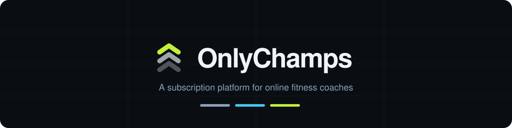

<br>


**Sell tiered memberships · Deliver programs and video · Coach clients directly**

<br>

### [**▶ Open the live demo**](https://only-champs.vercel.app)

One click signs you in as a coach or a client. No signup.

</div>

---

<div align="center">
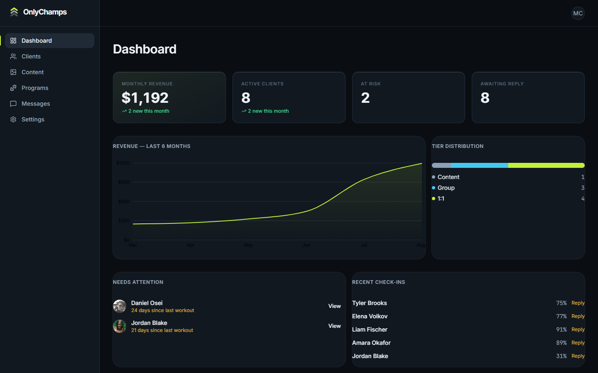
</div>

---

## The idea

One coach. Three levels of access. Same platform.

| | Tier | Typical price | What it unlocks |
|:--:|---|---|---|
| 🔘 | **Content** | $12–25/mo | Video library, weekly drops, community feed |
| 🔵 | **Group** | $39–79/mo | Everything above **+ group chat**, shared block |
| 🟢 | **1:1** | $149–299/mo | Everything above **+ direct chat**, custom programming |

> Coaching stops scaling at ~25 clients. The other 10,000 followers would pay $15/month for something lighter — and there's nowhere to put them.

---

## The engineering bit

**The tier gate lives in Postgres, not in React.**

```sql
create policy "read entitled posts" on posts
  for select using (
    published_at is not null
    and public.has_tier(coach_id, min_tier_level)
  );
```

A locked post's body **never leaves the database**. Not hidden with CSS, not filtered in the client — it is never sent.

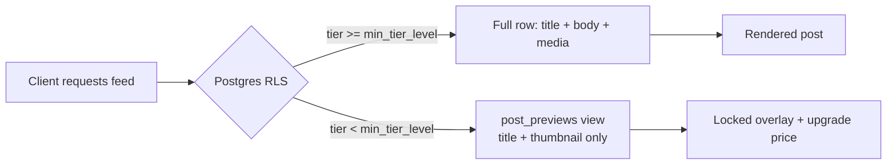

| Concern | Where it's solved |
|---|---|
| Who can read a post | `posts` RLS policy |
| Showing that locked content exists | `post_previews` view, `security_invoker = false` |
| Who can message whom | `conversations` RLS, evaluated on row columns |
| Public social proof without leaking rows | `coach_stats` aggregate view |
| Granting a tier | Service role only — clients have **no** INSERT policy |

---

## Screens

### Coach

| Clients | Content |
|---|---|
| 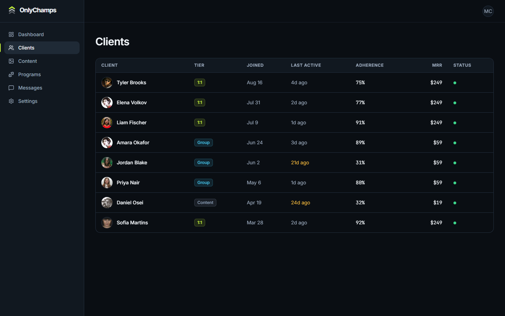 | 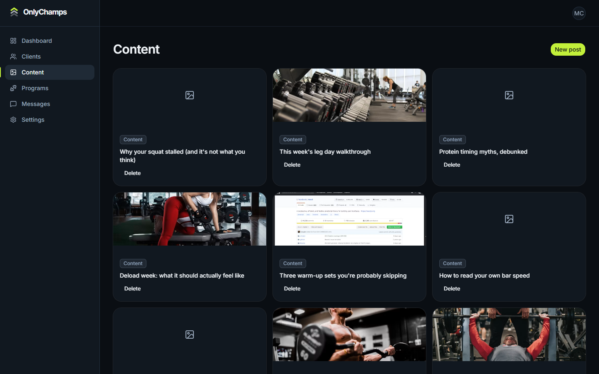 |
| Roster with MRR, adherence, last-active and at-risk flags | Tier-gated publishing with live subscriber counts |

| Programs | Settings |
|---|---|
| 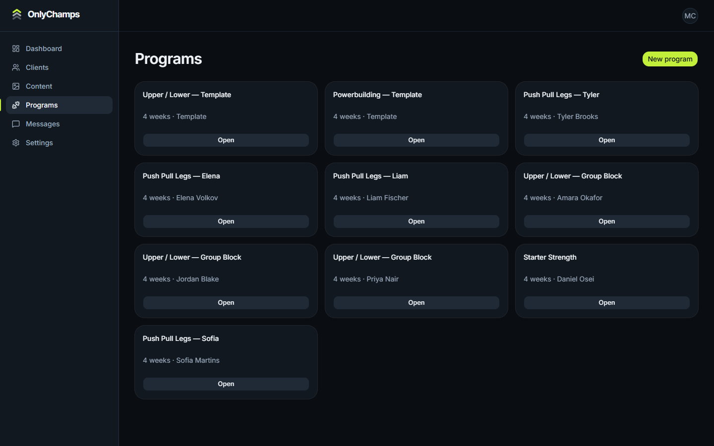 | 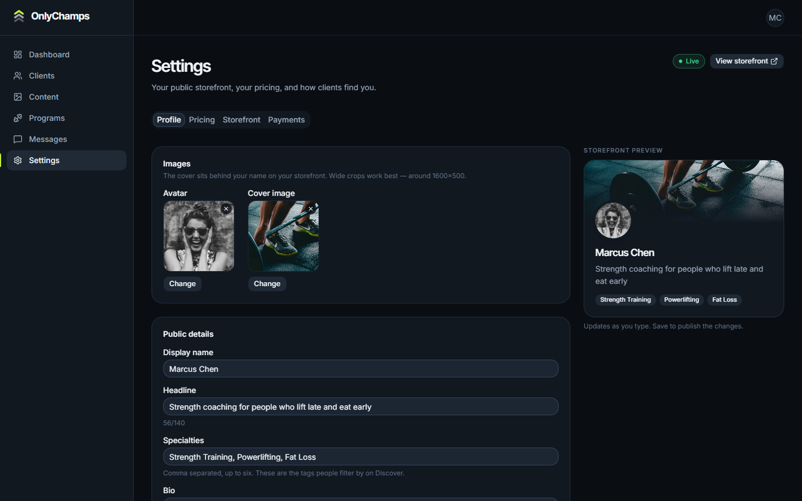 |
| Reusable templates and per-client assignments | Pricing ladder with a live storefront preview |

### Client

| Feed | Today |
|---|---|
| 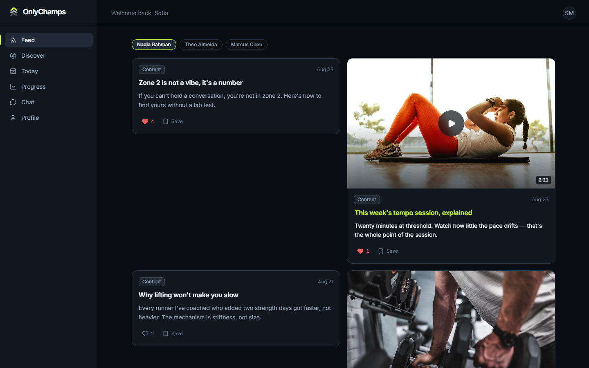 | 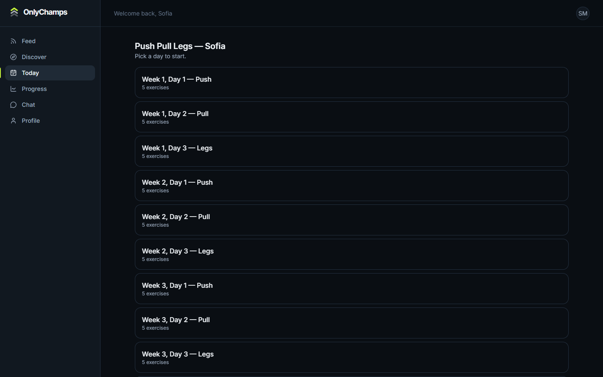 |
| Unlocked and locked posts side by side, likes and saves | Set-by-set logging, prefilled from last session |

| Progress | Profile |
|---|---|
| 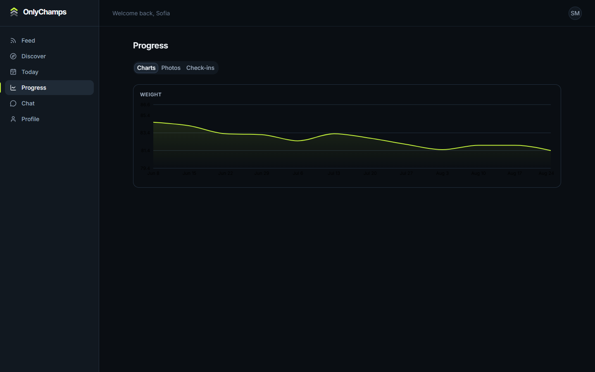 | 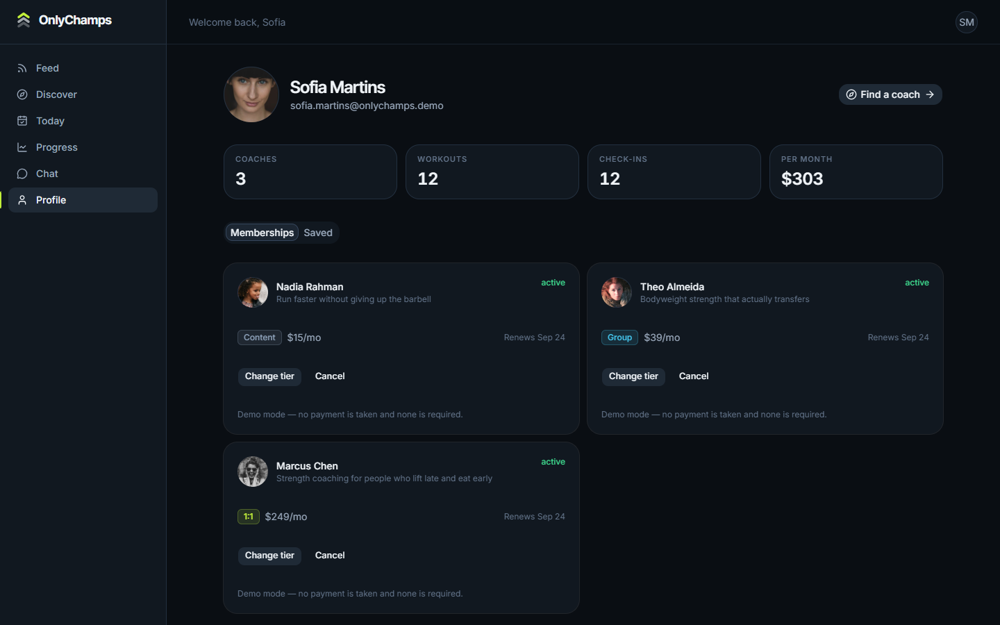 |
| Weight trend, photo timeline, weekly check-ins | Memberships, saved posts, training stats |

### Public

| Landing | Discover | Storefront |
|---|---|---|
| 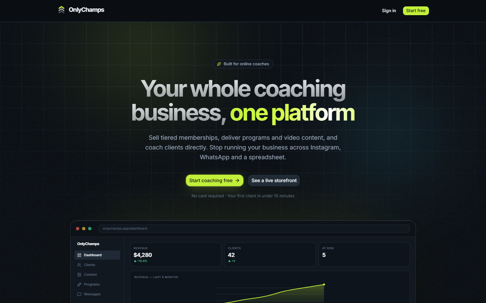 | 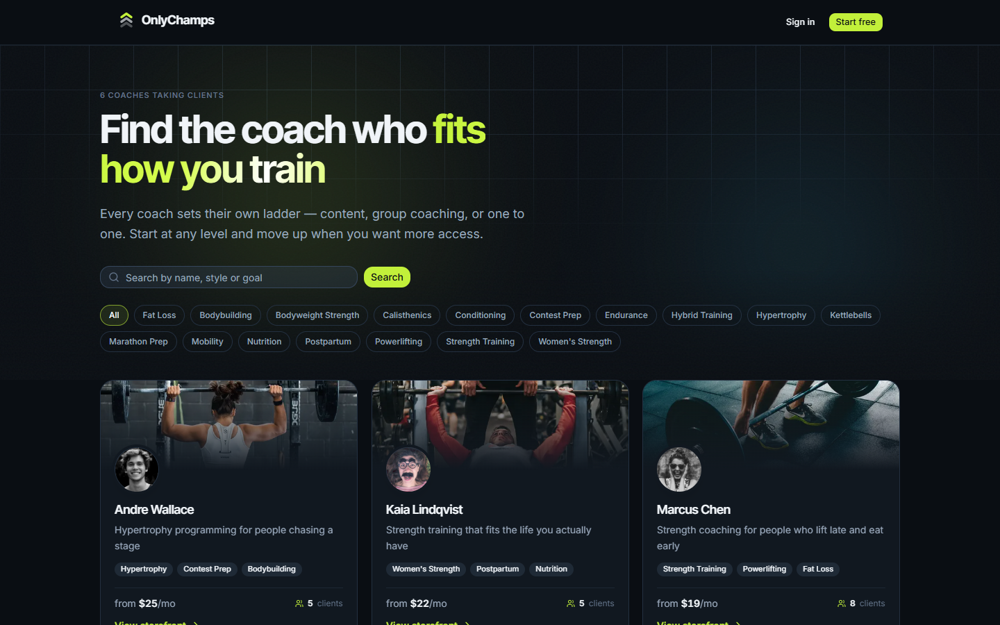 | 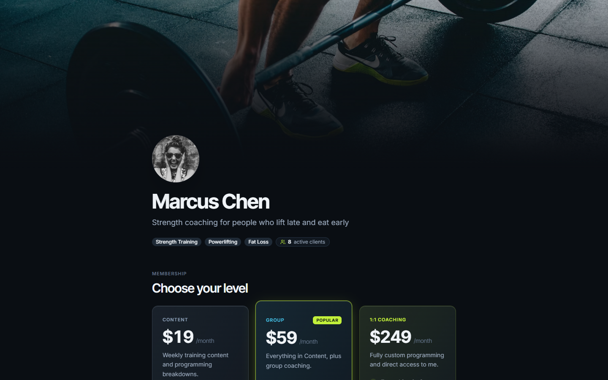 |

### Responsive

<div align="center">
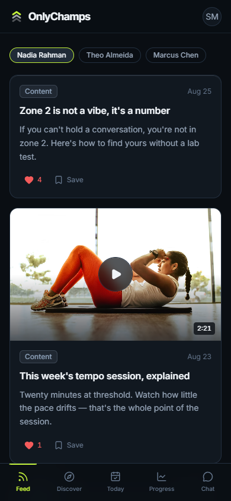
</div>

---

## Stack

| Layer | Choice | Why |
|---|---|---|
| **Framework** | Next.js 16, App Router | Server Components + Server Actions, no API layer |
| **Language** | TypeScript | Schema types generated from Postgres |
| **UI** | Tailwind v4 + shadcn/ui (Base UI) | CSS-first tokens, no config file |
| **Database** | Supabase Postgres | RLS is the product's core mechanism |
| **Auth** | Supabase Auth | Email + Google OAuth |
| **Realtime** | Supabase Realtime | Live chat over Postgres replication |
| **Storage** | Supabase Storage | Signed URLs on play, never public |
| **Charts** | Recharts | Dashboard and progress |
| **Hosting** | Vercel | Free tier, zero config |

---

## Try it

Every account uses the password `OnlyChamps2026!` — the sign-in page has **Coach** and **Client** buttons that fill the form for you.

**[only-champs.vercel.app](https://only-champs.vercel.app)**

| Role | Email | What you'll see |
|---|---|---|
| 🏋️ **Coach** | `marcus.chen@onlychamps.demo` | 8 clients, $1,192 MRR, 2 flagged at risk |
| 🥇 **Client** | `sofia.martins@onlychamps.demo` | 3 memberships at levels 3/2/1 — the whole ladder |
| 🥈 Client | `priya.nair@onlychamps.demo` | Group chat, shared block |
| 🥉 Client | `daniel.osei@onlychamps.demo` | Mostly locked feed |

<div align="center">
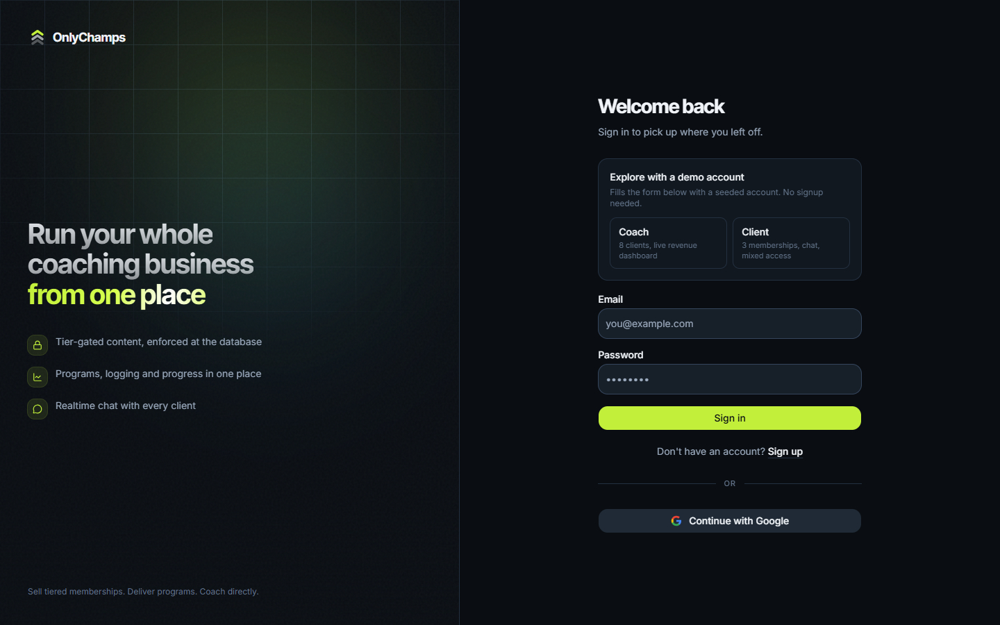
</div>

---

## Demo data

Not three rows of `Test User 1`.

| | Seeded |
|---|:--:|
| Coaches, each with their own ladder | **6** |
| Clients with real training history | **27** |
| Posts across all tiers | **76** |
| Workout + set logs | **362 / 5,875** |
| Check-ins with photos | **324** |
| Messages across 16 threads | **659** |

```bash
npx tsx supabase/seed.ts
```

---

## Run it

```bash
npm install
cp .env.example .env.local    # add your Supabase keys
npm run db:migrate            # apply supabase/migrations/*.sql
npx tsx supabase/seed.ts      # populate demo data
npm run dev
```

| Script | Does |
|---|---|
| `npm run dev` | Dev server |
| `npm run db:migrate` | Applies migrations over `DATABASE_URL` |
| `npx tsx supabase/seed.ts` | Seeds the demo marketplace |
| `node scripts/screenshots.mjs` | Regenerates the screenshots above |

---

## Deploy free

| Step | Where |
|---|---|
| 1. Import repo | Vercel → New Project |
| 2. Set 3 env vars | `NEXT_PUBLIC_SUPABASE_URL`, `NEXT_PUBLIC_SUPABASE_ANON_KEY`, `SUPABASE_SERVICE_ROLE_KEY` |
| 3. Set Site URL + `/auth/callback` | Supabase → Auth → URL Configuration |
| 4. Deploy | — |

> **`NEXT_PUBLIC_*` variables must not be marked Sensitive.** Vercel hides
> sensitive values from the build step, and Next.js inlines `NEXT_PUBLIC_`
> values at build time — so they arrive as `undefined` and every page 500s
> with "Your project's URL and Key are required". The anon key is meant to be
> public anyway; RLS is what protects the data. Add them with
> `vercel env add NAME production --no-sensitive`.

> ⚠️ **Supabase free projects pause after 7 days idle.** Vercel keeps serving, so the site looks live while every query fails. Check before sharing the link.

---

## Docs

| Doc | Covers |
|---|---|
| [00 — Architecture](docs/00-ARCHITECTURE.md) | Request lifecycles, repo layout, execution contexts |
| [01 — Database](docs/01-DATABASE.md) | Every table and policy as runnable SQL |
| [02 — Backend](docs/02-BACKEND.md) | Auth, server actions, realtime, seed spec |
| [03 — Design System](docs/03-DESIGN-SYSTEM.md) | Colour, type, spacing, motion, components |
| [04 — Frontend](docs/04-FRONTEND.md) | Every screen, its data, and all its states |
| [05 — Build Order](docs/05-BUILD-ORDER.md) | Phased task list and definition of done |

---

<div align="center">

**No payment processor.** Subscribing grants the tier instantly and free — deliberate for a demo, and the reason this must never hold real customer data.

<br>

Built by [Mahmoud Abou Amoun](https://github.com/MahmoudAmouni)

</div>
